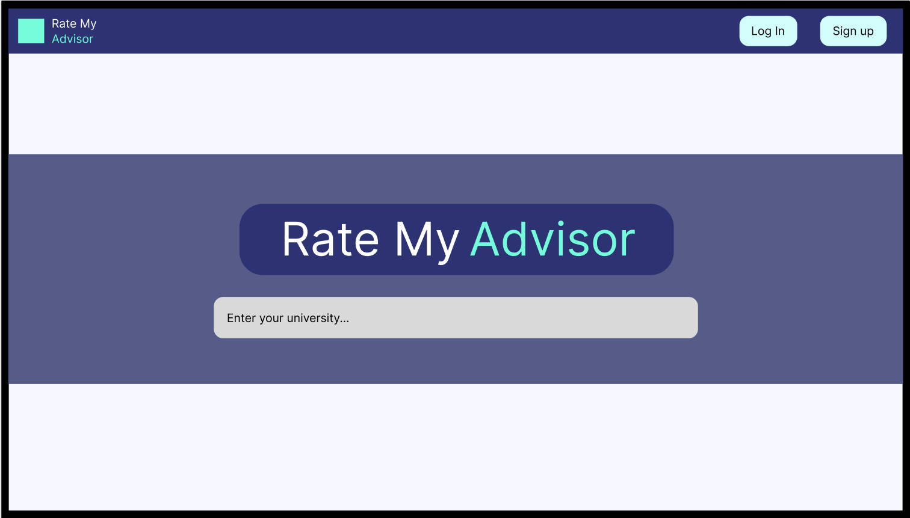
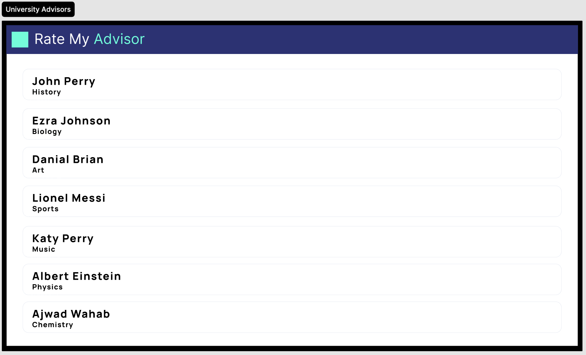
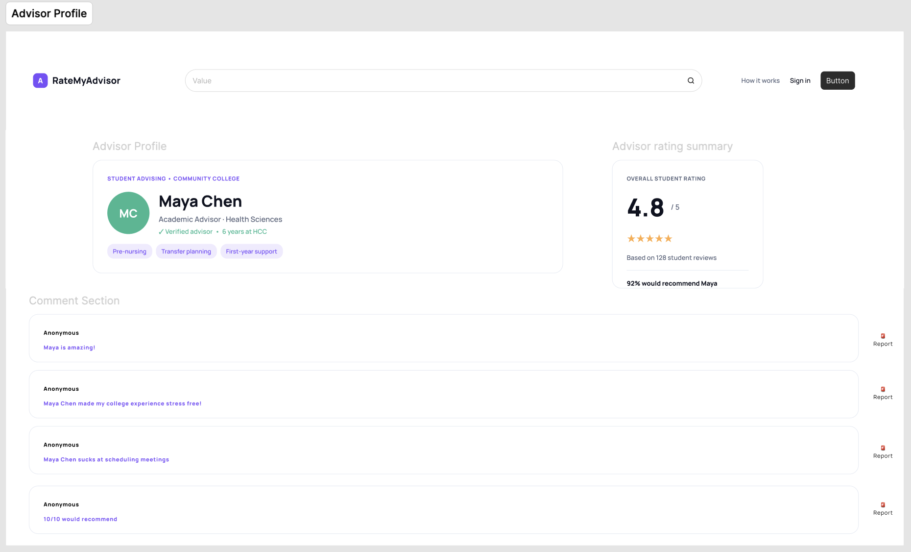

# Wireframes

Reference the Creating an Entity Relationship Diagram final project guide in the course portal for more information about how to complete this deliverable.

## List of Pages

[👉🏾👉🏾👉🏾 List the pages you expect to have in your app, with a ⭐ next to pages you have wireframed]

⭐ Listing all advisors of a specific university (in alphabetical order)
⭐ Advisor profile page with all comments/ratings below
- Comment page
⭐ Default main page (search for university)

Stretch feat. pages:
- Compare page (stretch)

## Wireframe 1: Homepage

## Wireframe 2: University Advisors

## Wireframe 3: Advisor Profile

